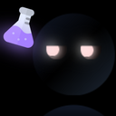
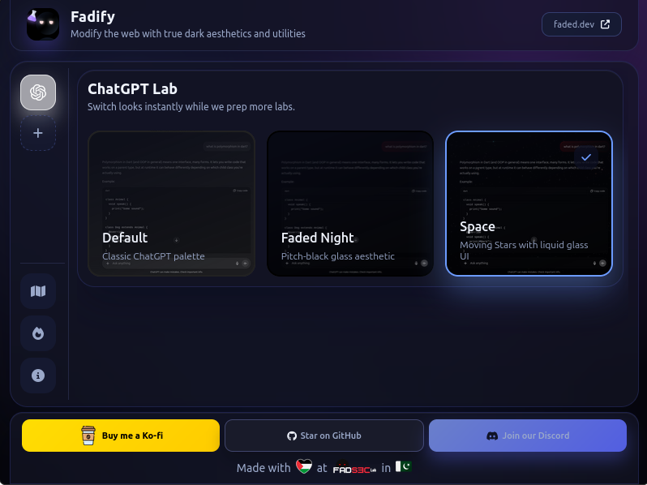
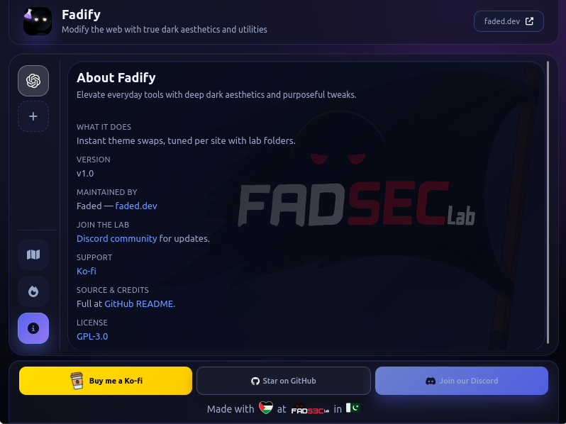
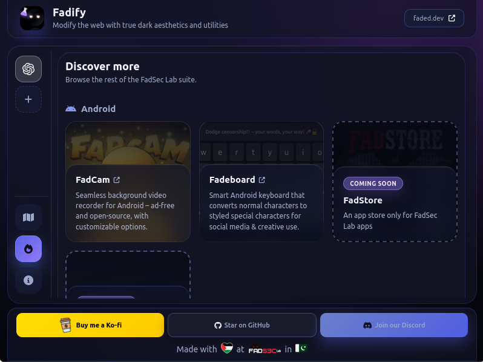
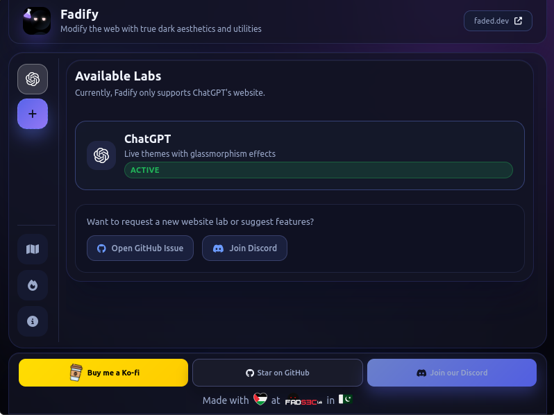
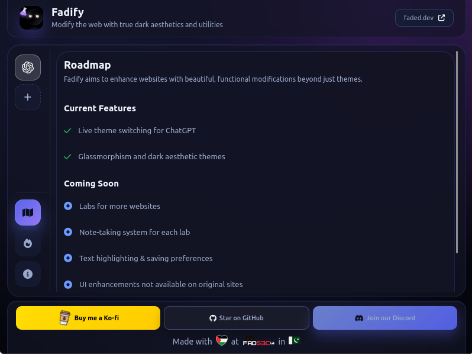

<div align="center">



# 🌙 Fadify

[](https://addons.mozilla.org/en-US/firefox/addon/fadify/)
[](https://github.com/anonfaded/Fadify)
[](LICENSE)
[](https://ko-fi.com/D1D510FNSV)
[](https://discord.gg/kvAZvdkuuN)

**Fadify** is a powerful Firefox extension that transforms your web experience with **true dark aesthetics** and modern utilities. Works on both **desktop and mobile Firefox**.

</div>

### 📹 Demo


https://github.com/user-attachments/assets/3c03f0fd-dd89-4624-8693-1397fe675181

*See Fadify in action with live theme switching*


---

## ✨ Features

- 🎨 **Live Theme Switching** - Instant theme changes, no page reload required
- 🧪 **Lab-Based Architecture** - Modular design with dedicated folders per website  
- 💾 **Persistent Preferences** - Your theme choices are remembered across sessions
- 🌙 **Dark Themes** - Including **Faded Night** (pitch black) and **Space** themes
- 📱 **Mobile & Desktop** - Works seamlessly on Firefox for Android and desktop
- ⚡ **Lightweight & Fast** - Minimal impact on browsing performance

### Currently Supported Sites
- ✅ **ChatGPT** - Complete theming with desktop and mobile optimization
- 🔜 **More labs coming soon...**

---

## 📸 Screenshots

<div align="center">

### Main Extension Popup


*Clean, modern interface for quick theme switching*

### About & Credits


*Extension information and version details*

### More Apps Integration  


*Discover and access the full FadSecLab app ecosystem*

### Labs Overview


*Track supported sites and upcoming lab additions*

### Development Roadmap


*Stay updated with planned features and development progress*

</div>

---

## 🏗️ Project Structure

```
Fadify/
├── manifest.json                 # Extension configuration
├── background.js                 # Background service worker  
├── popup/                        # Extension UI
│   ├── popup.html               # Main popup interface
│   ├── popup.js                 # UI logic and interactions
│   └── popup.css                # Responsive styling
├── utils/                        # Shared utilities
│   ├── preferences.js           # Settings management
│   └── Logger.js                # Debug logging
├── labs/                         # Website-specific modules
│   └── chatgpt/                 # ChatGPT lab
│       ├── ChatGPTContainer.js  # Theme definitions
│       ├── chatgpt.js           # Theme application logic
│       ├── chatgpt.css          # Theme styles
│       └── chatgpt.png          # Lab icon
├── data/                         # Extension data
│   └── apps.json                # FadSecLab apps catalog
└── assets/                       # Static resources
    ├── fadseclab/               # Icons and branding
    └── promo-screenshots/       # Documentation images
```

---

## 🚀 Installation

### From Firefox Add-ons (Recommended)
<div align="center">

[](https://addons.mozilla.org/en-US/firefox/addon/fadify/)

</div>

<details>
<summary><strong>📱 Manual Installation (Development)</strong></summary>

### Desktop Installation
1. **Clone the repository:**
   ```bash
   git clone https://github.com/anonfaded/Fadify.git
   cd Fadify
   ```

2. **Load in Firefox:**
   - Open Firefox and navigate to `about:debugging`
   - Click **"This Firefox"** in the sidebar
   - Click **"Load Temporary Add-on"**
   - Select the `manifest.json` file

### Mobile Installation (Android)
1. **Prerequisites:**
   - Install [web-ext](https://extensionworkshop.com/documentation/develop/getting-started-with-web-ext/)
   - Enable USB debugging on your Android device
   - Install Firefox for Android

2. **Load on Android:**
   ```bash
   web-ext run -t firefox-android --adb-device DEVICE_ID_HERE --firefox-apk org.mozilla.fenix
   ```

3. **Start using:**
   - Visit ChatGPT or any supported site
   - Tap the Fadify icon in your toolbar
   - Choose your preferred theme

</details>

---

## 🎨 Available Themes

| Theme | Description |
|-------|-------------|
| **Default** | Clean, original site styling |
| **Faded Night** | Deep black theme for true dark mode enthusiasts |
| **Space** | Cosmic dark theme with animated stars |

---

## 🛠️ Development

### Requirements
- **Firefox 79+** (Developer Edition recommended)
- Basic knowledge of JavaScript, HTML, and CSS
- Git for version control

### Adding New Labs
1. Create a new folder in `/labs/[website-name]/`
2. Add your theme definitions, styles, and logic
3. Update the manifest.json content scripts
4. Test thoroughly across different screen sizes

---

## 🤝 Contributing

We welcome contributions! Here's how to get involved:

1. **Fork the repository**
2. **Create a feature branch:** `git checkout -b feature/new-lab`
3. **Follow the lab-based architecture** - keep website-specific code in dedicated folders
4. **Test on both desktop and mobile Firefox**
5. **Submit a pull request** with a clear description

### Contribution Guidelines
- Maintain the modular lab structure
- Follow existing code patterns and naming conventions
- Include screenshots for UI changes
- Test theme persistence and mobile responsiveness

---

## © Credits

### Assets & Resources
- **Animated Stars Background**: [Space Background Animation by Pavel Kalmykov](https://vimeo.com/309240312) on Vimeo
- **ChatGPT Icon**: [Chatgpt icons created by Freepik - Flaticon](https://www.flaticon.com/free-icons/chatgpt)
- **Beaker/Labs Icon**: [Beaker icons created by Freepik - Flaticon](https://www.flaticon.com/free-icons/beaker)

---

## 📜 License

This project is licensed under the **GNU General Public License v3.0** - see the [LICENSE](LICENSE) file for details.

---

<div align="center">

**Made with ❤️ by [FadSec Lab](https://github.com/anonfaded)**

[](https://github.com/anonfaded)
[](https://addons.mozilla.org/en-US/firefox/addon/fadify/)

</div>
